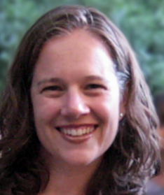

<!-- Canyons -->

```{r child="header.md"}
```

## StatPREP 2018 Summer Workshop: College of the Canyons


- Friday June 22th: 9am - 3:30pm
- Saturday June 23th: 9am - 3:30pm

Schedule of [workshop topics](../schedule.html).

## Hub leader

* Ambika Silva, `Ambika.Silva@canyons.edu`

## Wait List

As of mid-May, registration is full; we even have a wait list. Contact hub leader Ambika Silva for more information or if you are an already registered participant who won't be able to attend.

## Workshop leaders

Jo Hardin | Daniel Kaplan | Ambika Silva | Andy Zieffler 
:-------------:|:-------------:|:-----------:|:-------:|:-----:
  |  |  |   
Pomona College | Macalester College | College of the Canyons | Univ. of Minnesota 


