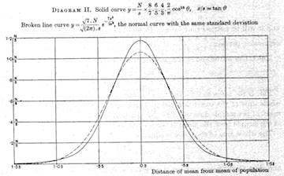

```{r setup, include=FALSE}
knitr::opts_chunk$set(echo = FALSE)
```

## Three styles

Three different audiences in one.

1. Students, seeing data-centric lessons
2. Instructors, learning some new tools and styles
3. Budding data scientists, learning tools for doing data science

## Results from the survey

1. I am willing to take this survey.  100% agree (sampling  bias?)
#. Institution type: about evenly split between two-year and four-year institutions
#. All but one of the 26 responding has taught introductory statistics.

## Results from the survey

4. What coursework did we take in graduate school?

```{r echo = FALSE, fig.center=TRUE, out.width = "60%"}

```

## Results from the survey

5. 70% of us have never taken applied stats coursework.
6. 50% "conduct statistical analyses of data outside of teaching (e.g., for your own research, consulting, etc.)"

## Results from the survey

7. Computing used

```{r echo = FALSE, fig.center=TRUE, out.width = "60%"}

```

## Results from the survey

8. We lack
    - Access to real data: 80%
    - Personal experience handling large data sets: 65%
    - Technology infrastructure for large data sets: 55%
    - Graphing ability: 50% [ci at 95%: 30-70%]
    
#. Obstacles to making changes    
    - Not enough personal time: 65%
    - Student characteristics: 60%
    - Technology constraints: 50% [ci at 95%: 30-70%]
    - Department or institutional constraints: 35%

## Results from the survey

Areas of consensus

- Students learn statistics more effectively from a good lecture than from a good activity. 80% disagree or strongly disaggree
- Students learn statistics more effectively by learning fewer topics in greater depth than learning more topics in less depth. 85% agree or strongly agree
  
## Results from the survey  
    
We disagree (about 50% for and 50% against)

- Students should learn how to read statistical tables of theoretical distributions (e.g., t-table, F-table).
- Students learn statistics more effectively when starting with theory and doing follow up work with data.
- Students learn statistics better by understanding how to express concepts with algebra.
- Students learn statistics better by understanding how to express concepts by using computer code (e.g., R)
    
## About tables ...

GAISE College report (p. 24)

> Drills with z-, t-, χ2, and F-tables. These skills are no longer necessary and do not reflect modern statistical practice. Since statistical software produces a p-value as part of performing a hypothesis test, a shift from finding p-values to interpreting p-values in context is appropriate.
    
## p value quiz

ASA statement: 

> *Underpinning many published scientific conclusions is the concept of “statistical significance,” typically assessed with an index called the p-value. While the p-value can be a useful statistical measure, it is commonly misused and misinterpreted.*

## Quiz: Agree or disagree?

1. P-values can indicate how incompatible the data are with a **specified statistical model**.

2. P-values do not measure the probability that the studied hypothesis is true, or the probability that the data were produced by random chance alone.

3. A p-value, or statistical significance, does not measure the size of an effect or the importance of a result.

4. By itself, a p-value does not provide a good measure of evidence regarding a model or hypothesis.

[Answers here](https://amstat.tandfonline.com/doi/pdf/10.1080/00031305.2016.1154108?needAccess=true)

## Theory or practice?

Is statistics ...

* an area of theory (like group theory or number theory or graph theory)
* a practical tool


<br>

<br>

<br>

Insofar as statistics is a practical tool, the stat education community some catching up to do.

## 1880s Galton and Benz

- 1885 Karl Benz designs 4-stroke engine for use in his automobile
- 1888 Francis Galton introduces the "co-relation" coefficient 

```{r echo = FALSE, out.width="50%"}
knitr::include_graphics("images/1885Benz.jpg")
knitr::include_graphics("images/Galtons_correlation_diagram_1875.jpg")
```

## 1908 Gossett and Ford

- First Model T off Henry Ford's production line
- William Gossett's t statistic  

```{r echo = FALSE, out.width = "50%"}
knitr::include_graphics("images/220px-1910Ford-T.jpg")

```

## 1920s

- 1925 ANOVA appears in Fisher's *Statistical Methods for Research Workers*  
- 1927 Ford Model A enters production

```{r echo = FALSE, out.width = "50%"}
knitr::include_graphics("images/1931_Ford_Model_A_Town_Car_Sedan_Delivery.jpg")
knitr::include_graphics("images/Fisher-F-distr.png")
```

## Orientation to the workshop agenda
