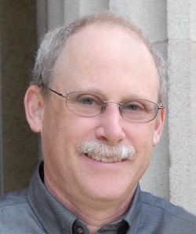
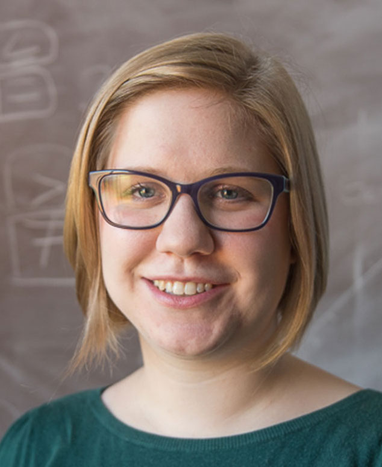
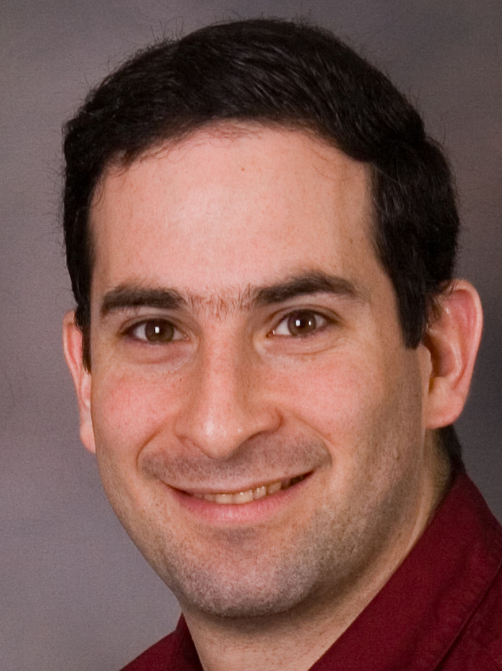

<!-- Hartford -->

```{r child="header.md"}
```

## University of Hartford

* Friday June 1st
    - 2:00pm Welcome* and Activity #2-4 on schedule
    - 4:00 Coffee-Break, Starbucks Coffee and Tea
    - 4:30-6:00 Work Activity #5-6 
    - 6:00 Dinner Buffet with vegetarian/vegan options, cheesecake, lemonade, coffee, water
    - 6:30 Adjourn 
* Saturday June 2nd
    - 8:30am Breakfast catered, pastries, oatmeal bar, hot sandwiches, fruits, tea, coffee, juices
    - 9:00-10:15am 1st morning session
    - 10:15-10:30  coffee break
    - 10:30-12:00pm 2nd morning session
    - 12:00-1:00pm Lunch catered
    - 1:00-2:30 1st pm session
    - 2:30-2:45 Coffee break, spinach dip, fruit, brownies, coffee/tea
    - 2:45-4:45 2nd pm session
    - 5:00 Adjourn
    

## Hub leader

* Hwayeon Ryu, `hryu@hartford.edu`

## Application to participate

As of late April, there are a few open spots for the workshop. Contact hub leader Hwayeon Ryu for more information.

## Workshop leaders

 Daniel Kaplan | Amelia McNamara | Michael Posner | Hwayeon Ryu
:-------------:|:-------------:|:-----------:|:-------:
 |  |   |   
Macalester College | Smith College | Villanova University | University of Hartford


