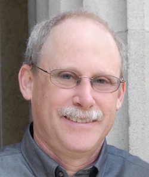

<!-- Seattle Highline -->

```{r child="header.md"}
```

## Highline College

- Friday June 15th: 9am - 3pm
- Saturday June 16th: 9am - 3pm


## The schedule in more detail ...

**Friday** and **Saturday**

8:30 AM Breakfast and meet and soft start (Eggs and Bacon, Coffee, Juice, Water)

9:00am-12:30pm See [topic schedule](../schedule.html)

12:30-1:15 Lunch 

1:15-3:00 pm See [topic schedule](../schedule.html)

3:00-3:15 Wrap-up


## Hub leader

* Helen Burns, `hburn@highline.edu`

## Application to participate

As of late April, there are a few open spots for the workshop. Contact hub leader Helen Burn for more information.

## Workshop leaders

Andrew Bray | Helen Burn | Daniel Kaplan | Randy Pruim 
:-------------:|:-------------:|:-----------:|:-------:|:-----:
 |  |  |   
Reed College | Highland College | Macalester College | Calvin College 


