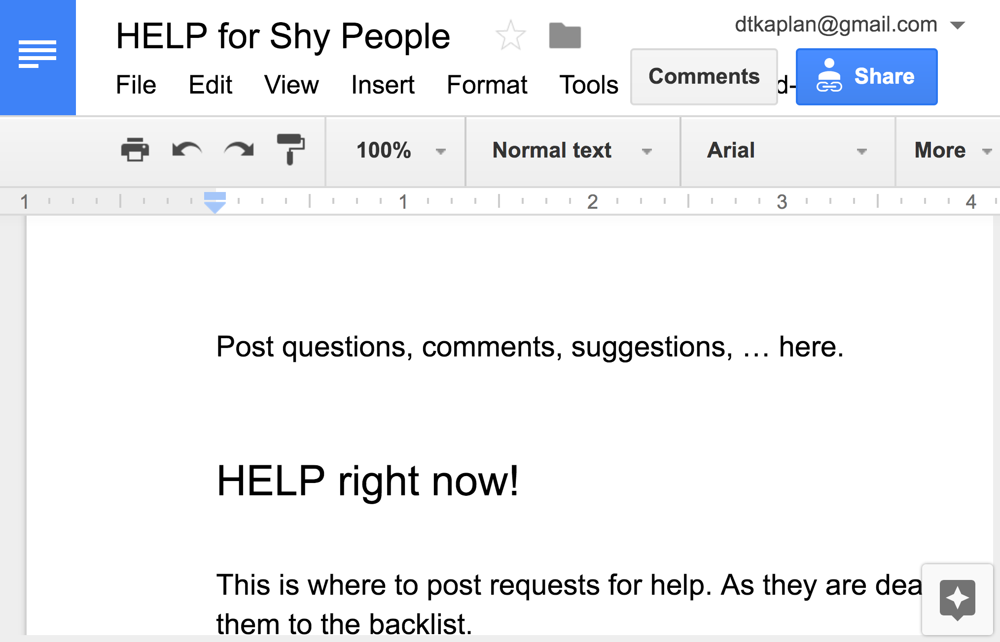

```{r child="header.md"}
```

# Schedule of Workshop Activities

This schedule is the central collection of links to items that will be used in the StatPREP workshops. Participants should bookmark it in the browser for easy access during the workshop.

This schedule does not include information about specific timing, breaks, meals, and such. That's because each of the four workshop locations will have slightly different arrangements with respect to those things.

You'll notice that there are three distinct styles of interaction planned for the workshop:

1. Presentations and discussions that are in the style of a class you might teach your own students, but with the workshop participants playing the role of the students.
2. Activities where the participants are preparing lessons for use in their own classrooms.
3. Training and work as data scientists undertaking analysis of data.

Schedule items will be marked with an icon indicating which styles are applicable.

### Help for shy people

<span style="color:red;"><strong>HELP!</strong></span> Everyone falls behind from time to time. But sometimes people are afraid to interrupt. 

<center><a href="https://docs.google.com/document/d/1jvHUafLPBKBOHLRGwHutf_hnRhkv-qiiRlgM_L57SA8/edit?usp=sharing"></a></center>

Click on the above document where you can post requests for help, suggestions, criticisms, complements, etc. The hub and the workshop leaders will be monitoring this during the workshop.

## Friday

1. [Welcome](greetings.html)[*](greetings.html)
2. Examples of in-class lessons centered on data
    - Start with graphics: Randy Pruim's first-day-of-class activity [tutorial](http://dtkaplan.shinyapps.io/USBirths) and [notes on plotting](http://dtkaplan.shinyapps.io/Plotting_with_formulas)
    - Lessons using the [Little Apps](http://remodeling.danielkaplan.org/post/little-apps-for-teaching-stats/)
    - Concept lesson: What's normal? [Background](http://statprep.org/lesson-whats-normal/) and [activity](https://dtkaplan.shinyapps.io/Whats_normal)
3. Collecting data with your students
    - Icebreaker
    - [Globe tossing](https://dtkaplan.shinyapps.io/Tutorial_Globe_toss/#section-how-big-is-africa-versus-asia)
    - [Hypothesis testing with shuffling](http://dtkaplan.shinyapps.io/Tutorial_Riverboat_shuffle)
4. Tidy data: 
    - [Notes](https://dtkaplan.github.io/SDS/tidy-data.html#May-16-2018-exer-4) 
    - Group activities [one](https://dtkaplan.github.io/SDS/tidy-data.html#May-16-2018-exer-2), [two](https://dtkaplan.github.io/SDS/tidy-data.html#May-16-2018-exer-4)
5. Computing in tutorial form
    - Starting R: [functions](http://dtkaplan.shinyapps.io/Functions), [formulas](http://dtkaplan.shinyapps.io/Formulas), and parts of speech [notes](http://gifted-saha-3345d3.netlify.com/post/reading-r/) and [quiz](https://dtkaplan.shinyapps.io/part-of-speech-quiz/)
    - [Tidy data frames](https://dtkaplan.shinyapps.io/Data_tables/)
    - [Statistics on one variable](http://dtkaplan.shinyapps.io/Qstats) [Note in draft, this needs to be updated to a version using `mosaicModel`.]
    - [Relationships between two variables](http://dtkaplan.shinyapps.io/Scatterplots)
    - For year-two workshops, there's an optional alternative track about using lessons in tutorial format.
6. [Computing with Little Apps](http://remodeling.danielkaplan.org/post/little-apps-for-teaching-stats/)

## Saturday

1. Exploring statistics using tutorials: a collection of choices
2. Statistical concepts
    - It's all [regression](https://dtkaplan.shinyapps.io/SimpleRegression/)
    - Simulation-based inference [sampling](http://dtkaplan.shinyapps.io/Sampling), [resampling](http://dtkaplan.shinyapps.io/Resampling), and [shuffling](https://dtkaplan.shinyapps.io/Permutation_test/)
3. Communicating with your students: Two tracks
    - Setting up a course web site: Links: [simple site] & [RStudio managed site]
    - Computing with [rstudio.cloud](http:rstudio.cloud)
4. Lesson development: Small group activity with two tracks
    - Developing lessons based on [Little Apps](http://remodeling.danielkaplan.org/post/little-apps-for-teaching-stats/)
    - Developing lessons using R commands. (An example from last year: )
5. Brief presentations of lessons developed
6. Evaluation: Help us improve!
6. Going forward ... support and staying in touch
